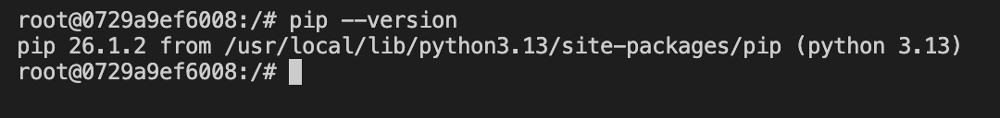

# HW1 Answers

## Question 1
Run docker with the python:3.13 image. Use an entrypoint bash to interact with the container. What's the version of pip in the image?



## Question 2
Given the following `docker-compose.yaml`, what is the hostname and port that pgadmin should use to connect to the postgres database?

```yaml
services:
  db:
    container_name: postgres
    image: postgres:17-alpine
    environment:
      POSTGRES_USER: 'postgres'
      POSTGRES_PASSWORD: 'postgres'
      POSTGRES_DB: 'ny_taxi'
    ports:
      - '5433:5432'
    volumes:
      - vol-pgdata:/var/lib/postgresql/data

  pgadmin:
    container_name: pgadmin
    image: dpage/pgadmin4:latest
    environment:
      PGADMIN_DEFAULT_EMAIL: "pgadmin@pgadmin.com"
      PGADMIN_DEFAULT_PASSWORD: "pgadmin"
    ports:
      - "8080:80"
    volumes:
      - vol-pgadmin_data:/var/lib/pgadmin

volumes:
  vol-pgdata:
    name: vol-pgdata
  vol-pgadmin_data:
    name: vol-pgadmin_data
```

**Answer:** hostname: `postgres`, port: `5432`

## Question 3
For the trips in November 2025 (lpep_pickup_datetime between '2025-11-01' and '2025-12-01', exclusive of the upper bound), how many trips had a trip_distance of less than or equal to 1 mile? 

**Answer:** 8000

## Question 4
What is the pick up day with the longest trip distance? Only consider trips with trip_distance less than 100 miles (to exclude data errors).

Use the pick up time for your calculations.

**Answer:** Timestamp('2025-11-14 15:36:27')

## Question 5
Which was the pickup zone with the largest total_amount (sum of all trips) on November 18th, 2025?

**Answer:** East Harlem North

## Question 6
For the passengers picked up in the zone named "East Harlem North" in November 2025, which was the drop off zone that had the largest tip?

Note: it's tip , not trip. We need the name of the zone, not the ID.

**Answer:** 


## Question 7. Terraform Workflow
Which of the following sequences, respectively, describes the workflow for:
Downloading the provider plugins and setting up backend,
Generating proposed changes and auto-executing the plan
Remove all resources managed by terraform

**Answer:** terraform init, terraform apply -auto-approve, terraform destroy
